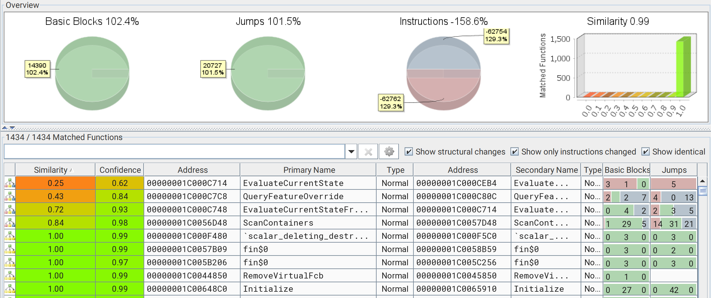

I enjoy reading patch analysis, so I decided to write my own. For the January Patch Tuesday, [CVE-2026-20820](https://msrc.microsoft.com/update-guide/en-US/vulnerability/CVE-2026-20820) caught my eye.

It hits the Common Log File System (`clfs.sys`), a driver that has been a literal goldmine for Elevation of Privilege (EoP) bugs in the past years. Microsoft labeled it a "Heap-based Buffer Overflow" and tagged it "Exploitation More Likely." At the time, the folks at BeFun Cyber Security Lab had already dropped a [DoS PoC](https://mp.weixin.qq.com/s/EpY0aTJjGrv-qSx9n8wbkA).

My goal? See if we can turn that "Denial of Service" into a nice "System Shell."

## The Hunt: Patch Diffing

I started by throwing the patched and unpatched versions of `clfs.sys` into Bindiff. One function stood out immediately: `CClfsRequest::ScanContainers`.



Microsoft loves wrapping their security fixes in A/B testing logic (Feature Descriptors) to toggle them on the fly. It makes our lives easier because it’s like a neon sign saying **"THE BUG IS HERE."**

Opening it in Ghidra was... dense. That's why I like to keep an IDA window next to it, comparing the two decompilers' output can speed up the analysis.

### The "Aha!" Moment

Looking at the IDA output for the patched version, the fix becomes obvious:

```cpp
// The Fix: Microsoft added a check for the 0x38 header offset
if ((unsigned int)EvaluateCurrentState(&g_Feature_PatchDescriptor)) {
    // v15 = v15 + 0x38
    v2 = RtlULongAdd(v15, 0x38u, &v15); 
    if ( v2 < 0 ) goto LABEL_ERROR;
}

// Check if our calculated size exceeds the actual buffer
if ( v15 <= *(_DWORD *)(v6 + 0x8) ) {
    // ... proceed to call the container scan
}

```

The logic before the patch was:


$$
v15 = maxContainers \times 0x240
$$


The logic after the patch is:


$$
v15 = (maxContainers \times 0x240) + 0x38
$$


Wait, so if the unpatched code forgets to account for that `0x38` offset, we can satisfy the length check while still overflowing the actual buffer? Let’s find out what these variables actually represent.

## Reverse Engineering the Context

The raw decompile was a start, but it was still full of generic pointers and offsets. To actually see what the driver was doing when satisfying the length check, I needed to recover the object types. I imported Juan Sacco's [wdk_full_26100.gdt](https://github.com/jsacco/ghidraGDT/blob/main/wdk_full_26100.gdt) into Ghidra to get the proper `clfsw32.h` definitions.

Then, to resolve the C++ virtual calls, I ran a combination of my own scripts: [CppClassExtractor.py](https://github.com/CravateRouge/ghidra_resources/blob/main/scripts/CppClassExtractor.py) to map the vtable pointers and [DatatypeMerger.py](https://github.com/CravateRouge/ghidra_resources/blob/main/scripts/DatatypeMerger.py) to sync the PDB types with the new GDT.

Suddenly, the "mystery function call" after length check transformed into a clear call to `ScanContainers()`.**This is where the actual vulnerability lives**, the driver takes the results of its container scan and writes them into a destination buffer, represented here by `v3`:

```cpp
// After applying custom GDTs and vtable reconstruction
// (I kept IDA variables' name)
v2 = (*((CClfsLogFcbPhysical *)this->fcb)->vptr_for_CClfsLogFcbCommon->ScanContainers)(
        (CClfsLogFcbPhysical *)this->fcb,
        (_CLS_CONTAINER_INFORMATION *)((longlong)v3 + 0x38), // The target buffer
        v12,
        v10, // maxContainers
        &v17,
        Priority,
        &v16
     );
```

By tracing `v3` (which eventually becomes our buffer), I saw it coming from [MmMapLockedPagesSpecifyCache()](https://learn.microsoft.com/en-us/windows-hardware/drivers/ddi/wdm/nf-wdm-mmmaplockedpagesspecifycache). This is a crucial pivot: it confirms the driver is creating a **System Virtual Address** mapping for a buffer we allocated in **User Space**.

Essentially, the driver takes our user-mode memory pages, locks them in physical RAM so they can't be paged out, and then maps them into the kernel's high-address memory range so `clfs.sys` can write the scan results directly into them.

This is standard driver behavior for I/O:

1. The user provides a buffer in their process.
2. The kernel creates an MDL (Memory Descriptor List) describing the physical pages of that buffer.
3. The driver calls `MmMapLockedPagesSpecifyCache()` to get a kernel-accessible pointer (`v3`) to those same physical pages.

I fired up WinDbg and set a breakpoint on `CLFS!CClfsRequest::ScanContainers`. Using a Microsoft [code sample](https://learn.microsoft.com/en-us/previous-versions/windows/desktop/clfs/enumerating-log-containers) for log container enumeration (and replacing `OPEN_EXISTING` by `OPEN_ALWAYS` in `CreateLogFile()` since I was starting fresh), I hit the breakpoint.

```ps1
1: kd> ? rax  # This is v15
Evaluate expression: 576 = 00000000`00000240
1: kd> dd @r14+8 L1 # This is the buffer size check
ffffe588`a9c2dc58  00000278

```

The math check out. `0x240` (one container) is less than `0x278` (the buffer size). But the code then tries to write to that buffer starting at offset `0x38`.

If we have a buffer of size `0x240`, the check passes because `0x240 <= 0x240`. But when the driver starts writing at `buffer + 0x38`, it will write `0x240` bytes, ending at `0x278`. **That's a 0x38-byte out-of-bounds write.**

## Triggering the Bug

The standard WinAPI [CreateLogContainerScanContext()](https://learn.microsoft.com/en-us/windows/win32/api/clfsw32/nf-clfsw32-createlogcontainerscancontext) is too "safe", it always allocates enough room for the header. To trigger this, we have to go lower. We need [DeviceIoControl()](https://learn.microsoft.com/en-us/windows/win32/api/ioapiset/nf-ioapiset-deviceiocontrol).

After digging through `CClfsRequest::Dispatch`, I found the IOCTL code: `0x80076816`.

The trick here is memory alignment. If we just allocate a small buffer, the overflow might stay within the same 4KiB page and land in a harmless spot. To get a stable crash (and eventually an exploit), we want that overflow to cross a page boundary into unmapped or protected memory.

I used `VirtualAlloc()` to grab a page and placed my buffer right at the end:

```cpp
SIZE_T cInfoSize = 0x240; 
BYTE* pageEnd = base + page;
BYTE* outBuff = pageEnd - cInfoSize; // Align buffer to the very end of the page

// ... fill outBuff with required CLFS headers ...

DeviceIoControl(logHndl, 0x80076816, NULL, 0, outBuff, cInfoSize, &bytes, NULL);

```

Full PoC can be found on [Github gist](https://gist.github.com/CravateRouge/5d3b20012a2b18feca6a9019ac67fd92)

## Result: Blue Screen of Death

Running the PoC results in a beautiful `PAGE_FAULT_IN_NONPAGED_AREA`.

```text
Arg1: ffffe300714c4028, memory referenced. (The address just past our page)
Arg2: 0000000000000002, Write operation.
Arg3: fffff80267d86c0f, Instruction address.

```


## The Reality Check: Is it exploitable?

Microsoft called this a "Heap-based Buffer Overflow.". **It isn't.**

Since the buffer is mapped via MDL from user space into system space, it’s not sitting on the traditional Kernel Pool. This means no [Pool Header corruption](https://www.sstic.org/media/SSTIC2020/SSTIC-actes/pool_overflow_exploitation_since_windows_10_19h1/SSTIC2020-Article-pool_overflow_exploitation_since_windows_10_19h1-bayet_fariello.pdf).


To get EoP, we would need to find a way to make the kernel map a critical structure *immediately* following our buffer in the virtual address space. And with that, the data we overflow is also constrained:

```cpp
p_Var7->State = ...;
p_Var7->PhysicalContainerId = ...;
p_Var7->LogicalContainerId = ...;

```

We are overwriting with container IDs and state flags at fixed positions. Unless you can find a structure that can be put next to it and where overwriting a few bytes at the beginning with a `0x00000001` leads to code execution, this is likely "just" a DoS.

If you’ve found a way to groom the System VA space to make this useful, hit me up.