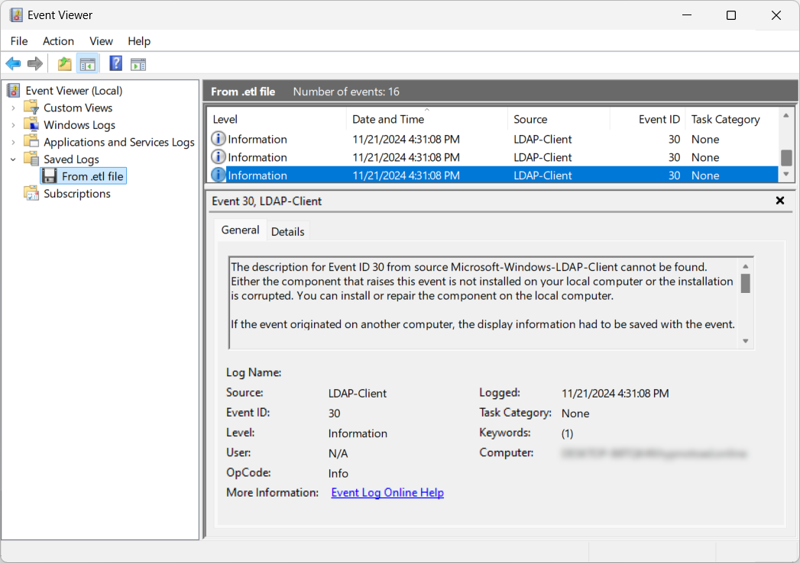
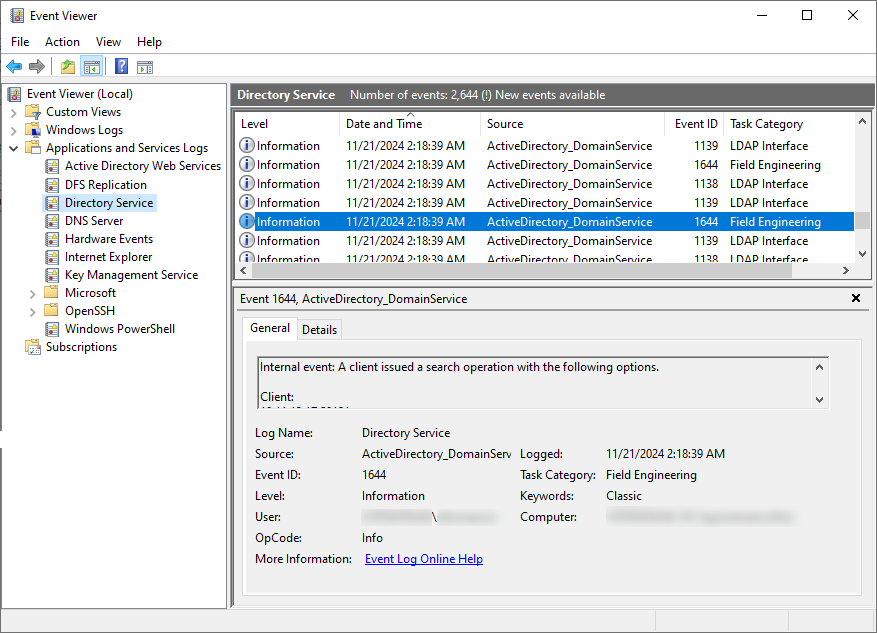

Il y a quelque temps, un gars de la blueteam m'a contacté, embêté car il pouvait détecter les requêtes LDAP de SharpHound mais ne trouvait aucune trace des requêtes LDAP effectuées avec [bloodyAD](https://github.com/CravateRouge/bloodyAD) (un outil d'audit AD que je développe) dans son SIEM. J'étais perplexe et voulais enquêter davantage, mais j'ai oublié jusqu'à récemment 😅. En développant de nouvelles fonctionnalités pour mon outil, j'ai réalisé que je ne voyais aucune requête LDAP dans les journaux du contrôleur de domaine (DC) pour m'aider à déboguer.

## Journalisation LDAP dans Active Directory
De ce que je sais, il existe 3 [méthodes courantes](https://unit42.paloaltonetworks.com/lightweight-directory-access-protocol-based-attacks/) (faites-moi savoir si j'en ai oublié une) :
- __Journalisation côté client__ : `Microsoft-Windows-LDAP-Client - Event ID 30`\
Celle-ci enregistre des détails tels que le processus responsable de la recherche LDAP, l'entrée recherchée, le filtre et la portée de recherche lorsque LDAP est accédé via l'API client LDAP via `wldap32.dll`.\

- __Sniffing réseau__ : Capture du trafic LDAP.
- __Journalisation côté DC__ : `Microsoft-Windows-ActiveDirectory_DomainService - Event ID 1644`\
Celle-ci enregistre les requêtes LDAP coûteuses, inefficaces ou lentes effectuées sur les contrôleurs de domaine par les machines clientes.\


## Contournement de la journalisation LDAP
- __Journalisation côté client__ : Facilement contourné en n'étant pas sur une machine surveillée ou en utilisant un outil qui n'appelle pas `wldap32.dll` pour effectuer des requêtes LDAP (par exemple, des outils Python comme [bloodhound.py](https://github.com/dirkjanm/BloodHound.py) ou [bloodyAD](https://github.com/CravateRouge/bloodyAD)).\
- __Sniffing réseau__ : Contourné en utilisant le chiffrement des sessions LDAP, qui est la configuration par défaut pour [bloodyAD](https://github.com/CravateRouge/bloodyAD) et tout outil utilisant les bibliothèques Windows (LDAPS n'est pas requis pour le chiffrement).
- __Journalisation côté DC__ : Si configuré strictement, la journalisation ne peut pas être contournée. Cependant, une configuration stricte est plus complexe qu'il n'y paraît, ce qui explique pourquoi [bloodyAD](https://github.com/CravateRouge/bloodyAD) a contourné les capacités de détection de la blueteam.

### Regard approfondi sur la journalisation LDAP côté DC
Par défaut, [les requêtes LDAP ne sont pas enregistrées](https://learn.microsoft.com/en-us/troubleshoot/windows-server/active-directory/configure-ad-and-lds-event-logging#enable-field-engineering-diagnostic-event-logging) côté DC. Pour activer la journalisation, définissez la clé de registre suivante sur __5__ :
```
HKEY_LOCAL_MACHINE\SYSTEM\CurrentControlSet\Services\NTDS\Diagnostics\Field Engineering
```
Cependant, seules certaines requêtes seront enregistrées de cette manière. Cette journalisation est conçue pour détecter les requêtes LDAP coûteuses et inefficaces, pas les potentielles attaques. Les seuils par défaut pour considérer une requête comme coûteuse ou inefficace sont les suivants :
- [Seuil des résultats de recherche coûteux](https://learn.microsoft.com/en-us/previous-versions/ms808539(v=msdn.10)#tracking-expensive-and-inefficient-searches) (par défaut 10000) : Une requête LDAP est considérée comme _coûteuse_ si elle visite plus de 10 000 entrées.
- [Seuil des résultats de recherche inefficaces](https://learn.microsoft.com/en-us/previous-versions/ms808539(v=msdn.10)#tracking-expensive-and-inefficient-searches) (par défaut 1000) : Une requête LDAP est considérée comme _inefficace_ si la recherche visite plus de 1 000 entrées et que les entrées retournées sont inférieures à 10 % des entrées visitées.
- __Seuil de temps de recherche__ (par défaut 30s) : Une requête LDAP est considérée comme coûteuse/inefficace si elle prend plus de 30 secondes.

Ces [seuils](https://learn.microsoft.com/en-us/troubleshoot/windows-server/active-directory/event1644reader-analyze-ldap-query-performance#how-to-use-the-script) peuvent être modifiés en créant les clés de registre suivantes et en définissant des valeurs inférieures :
| Chemin du registre | Type de données | Valeur par défaut |
|---------------------|-----------------|-------------------|
| `HKEY_LOCAL_MACHINE\SYSTEM\CurrentControlSet\Services\NTDS\Parameters\Search Time Threshold (msecs)` | DWORD | 30,000 |
| `HKEY_LOCAL_MACHINE\SYSTEM\CurrentControlSet\Services\NTDS\Parameters\Expensive Search Results Threshold` | DWORD | 10,000 |
| `HKEY_LOCAL_MACHINE\SYSTEM\CurrentControlSet\Services\NTDS\Parameters\Inefficient Search Results Threshold` | DWORD | 1,000 |
{class="overflow-auto block"}
La méthode intuitive serait de tout mettre à __0__ pour pouvoir voir chaque requête LDAP, mais en réalité, d'après mes tests, si vous faites ça, Windows ignorera ces valeurs et utilisera les valeurs par défaut à la place. C'est la partie délicate qui explique pourquoi certains outils de détection de menaces peuvent être aveugles à certaines requêtes LDAP.

La bonne chose à faire pour activer une journalisation maximale est de ne créer que la clé de registre _Expensive search results threshold_ et de la définir sur __1__. Avec ces paramètres, même [bloodyAD](https://github.com/CravateRouge/bloodyAD) ne peut pas contourner la détection LDAP !

> [!NOTE]
>On peut aussi créer une policy d'audit par objet mais j'en parlerai prochainement dans un nouvel article.

## Conclusion
Configurer correctement les journaux LDAP pour détecter les menaces est plus complexe qu'il n'y paraît. Les membres de la blueteam doivent être prudents lors de la configuration. Pour les membres de la redteam, voici quelques conseils pour réduire les chances de détection de vos requêtes LDAP, en particulier pour celles signalées comme la recherche d'[utilisateurs AS-REP roastables](https://github.com/CravateRouge/bloodyAD/wiki/Enumeration#get-accounts-that-do-not-require-kerberos-pre-authentication-as-rep) :
- Évitez d'utiliser `wldap32.dll` sur des machines surveillées
- Utilisez un outil prenant en charge le chiffrement LDAP
- Réduisez la base de votre requête LDAP pour rester en dessous des seuils (par exemple, effectuez la recherche d'utilisateurs AS-REP roastables sur `CN=Users,Dc=bloody,DC=corp` au lieu de `DC=bloody,DC=corp`)

C'est tout pour cet article, j'espère que cela vous donnera une meilleure compréhension des détections de requêtes LDAP dans les environnements AD.
