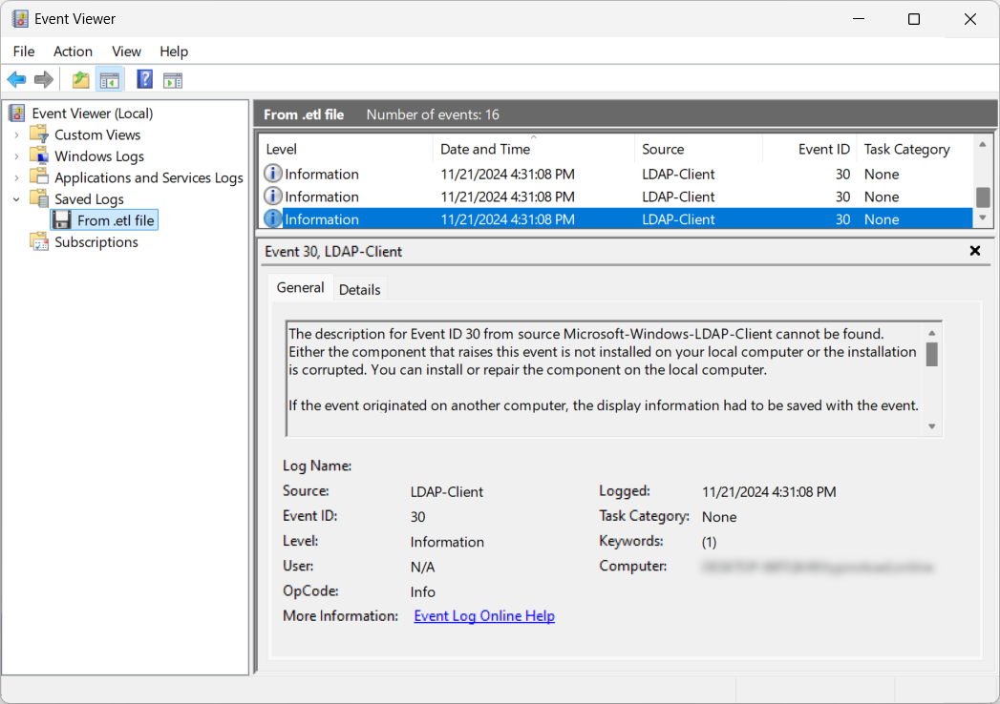

A while ago, a blueteam guy reached out to me, embarrassed because he could detect SharpHound LDAP queries but found no traces of LDAP queries made with [bloodyAD](https://github.com/CravateRouge/bloodyAD) (an AD audit tool I develop) in his SIEM. I was puzzled and wanted to investigate further but then I forgot about it until recently 😅. While developing new functionalities for my tool, I realized I couldn't see any LDAP queries in the Domain Controller (DC) logs to aid me debugging. 

## LDAP logging in Active Directory
As far as I know there are 3 [common methods](https://unit42.paloaltonetworks.com/lightweight-directory-access-protocol-based-attacks/) (let me know if I forgot one):
- __Client-side Logging__: `Microsoft-Windows-LDAP-Client - Event ID 30`\
This logs details such as the initiating process, search entry, filter and search scope when LDAP is accessed via the LDAP client API through `wldap32.dll`.\

- __Network sniffing__: Capturing LDAP traffic.
- __DC-side Logging__: `Microsoft-Windows-ActiveDirectory_DomainService - Event ID 1644`\
This logs expensive, inefficient or slow LDAP queries made to domain controllers from all interacting hosts.\


## Bypassing LDAP logging
- __Client-side Logging__: Easily bypassed by not being on a monitored machine or using a tool not calling `wldap32.dll` to perform LDAP queries (e.g., Python tools like [bloodhound.py](https://github.com/dirkjanm/BloodHound.py) or [bloodyAD](https://github.com/CravateRouge/bloodyAD)).\
- __Network sniffing__: Bypassed using LDAP session encryption which is the default for [bloodyAD](https://github.com/CravateRouge/bloodyAD) and any tool using Windows libraries (LDAPS is not required for encryption).
- __DC-side Logging__: If configured strictly, logging cannot be bypassed. However, strict configuration is trickier than expected, which is why [bloodyAD](https://github.com/CravateRouge/bloodyAD) bypassed the detection capabilities of the blueteam guy.

### Closer look of LDAP logging on DC
LDAP queries [aren't logged by default](https://learn.microsoft.com/en-us/troubleshoot/windows-server/active-directory/configure-ad-and-lds-event-logging#enable-field-engineering-diagnostic-event-logging) on DC-side. To enable logging, set the following registry key to __5__:
```
HKEY_LOCAL_MACHINE\SYSTEM\CurrentControlSet\Services\NTDS\Diagnostics\Field Engineering
```
However, only some queries are logged this way. This logging capability is designed to detect expensive and inefficient LDAP queries, not threats. The default thresholds to consider a query as expensive and inefficient are the following:
- [Expensive Search Results Threshold](https://learn.microsoft.com/en-us/previous-versions/ms808539(v=msdn.10)#tracking-expensive-and-inefficient-searches) (default 10000): A LDAP query is considered _expensive_ if it visits more than 10,000 entries.
- [Inefficient Search Results Threshold](https://learn.microsoft.com/en-us/previous-versions/ms808539(v=msdn.10)#tracking-expensive-and-inefficient-searches) (default 1000): A LDAP query is considered _inefficient_ if the search visits more than 1,000 entries and the returned entries are less than 10 percent of the entries that it visited.
- __Search Time Threshold__ (default 30s): A LDAP query is considered expensive/inefficient if it takes more than 30 seconds.

Those [thresholds](https://learn.microsoft.com/en-us/troubleshoot/windows-server/active-directory/event1644reader-analyze-ldap-query-performance#how-to-use-the-script) can be modified by creating the following registry keys and setting lower values to them:
| Registry path | Data Type | Default Value |
|---------------|-----------|---------------|
| `HKEY_LOCAL_MACHINE\SYSTEM\CurrentControlSet\Services\NTDS\Parameters\Search Time Threshold (msecs)` | DWORD | 30,000 |
| `HKEY_LOCAL_MACHINE\SYSTEM\CurrentControlSet\Services\NTDS\Parameters\Expensive Search Results Threshold` | DWORD | 10,000 |
| `HKEY_LOCAL_MACHINE\SYSTEM\CurrentControlSet\Services\NTDS\Parameters\Inefficient Search Results Threshold` | DWORD | 1,000 |
{class="overflow-auto block"}
The intuitive way would be to set everything to __0__ to be able to see every LDAP query but actually from my experience, if you do that, Windows will then ignore these values and use the default values instead. This is the tricky part explaining that some threats detection tools can be blind for some LDAP queries.

The right thing to do to enable maximum logging is to only create _Expensive search results threshold_ registry key and set it to __1__. With these settings, even [bloodyAD](https://github.com/CravateRouge/bloodyAD) cannot bypass LDAP detection!

## Conclusion
Logging correctly LDAP queries for threats detection is trickier than it seems. Blueteam guys should be careful when setting it up. For redteam guys, here are some tips to lower the chance of detection for your LDAP queries, especially for flagged ones like the one for [AS-REP roastable users](https://github.com/CravateRouge/bloodyAD/wiki/Enumeration#get-accounts-that-do-not-require-kerberos-pre-authentication-as-rep):
- Avoid using `wldap32.dll` on monitored machines
- Use a tool that support LDAP encryption
- Narrow the base of your LDAP query to stay below the thresholds (e.g., perform the AS-REP roastable users search on `CN=Users,Dc=bloody,DC=corp` instead of `DC=bloody,DC=corp`)

That's all for this post, hope this gives you a better understanding of LDAP query detections in AD environments.