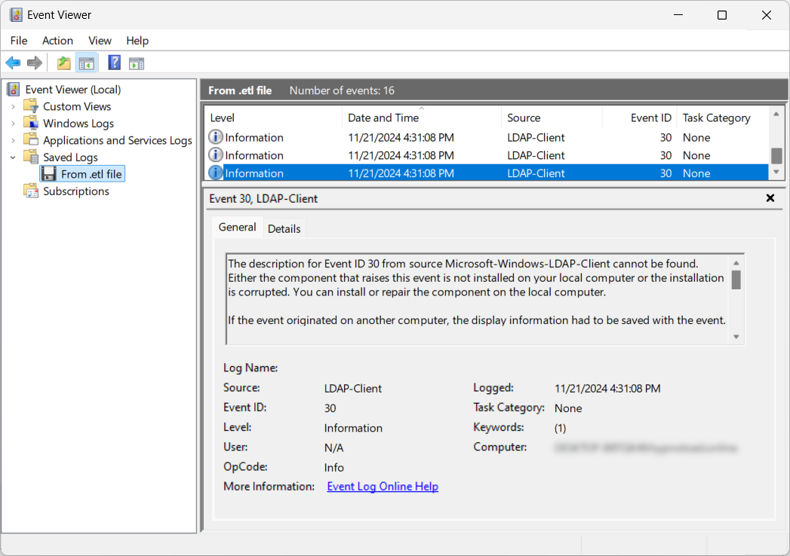
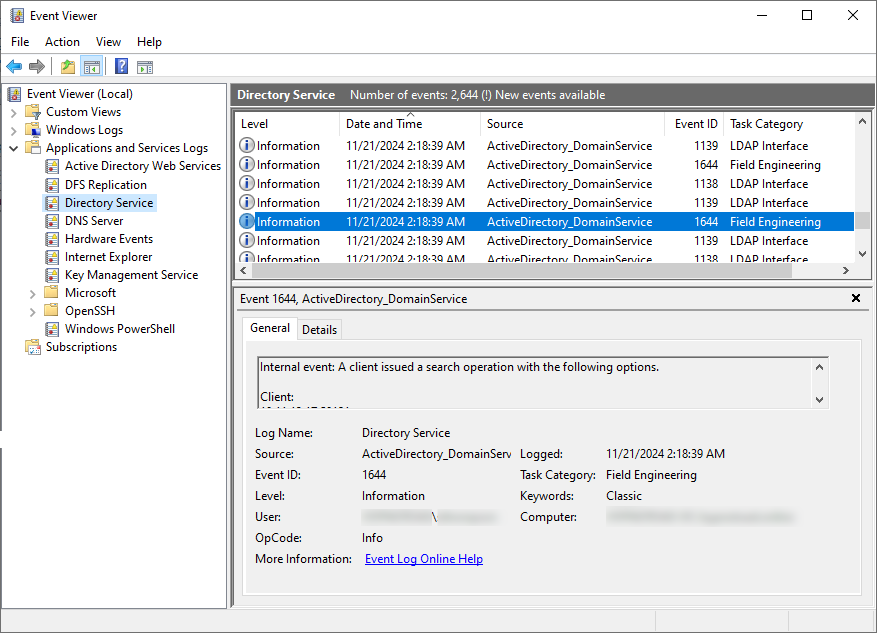

不久前，一位蓝队成员联系了我，他很尴尬，因为他能够检测到 SharpHound 的 LDAP 查询，但在他的 SIEM 中找不到使用 [bloodyAD](https://github.com/CravateRouge/bloodyAD)（我开发的一个 AD 审计工具）进行的 LDAP 查询的任何痕迹。我感到困惑并想进一步调查，但后来忘记了，直到最近 😅。在为我的工具开发新功能时，我意识到我无法在域控制器 (DC) 日志中看到任何 LDAP 查询来帮助我调试。

## Active Directory 中的 LDAP 日志记录
据我所知，有三种[常见方法](https://unit42.paloaltonetworks.com/lightweight-directory-access-protocol-based-attacks/)（如果我遗漏了，请告诉我）：
- __客户端日志记录__：`Microsoft-Windows-LDAP-Client - Event ID 30`\
当通过 `wldap32.dll` 使用 LDAP 客户端 API 访问 LDAP 时，此日志记录详细信息，例如启动进程、搜索条目、过滤器和搜索范围。\

- __网络嗅探__：捕获 LDAP 流量。
- __DC 端日志记录__：`Microsoft-Windows-ActiveDirectory_DomainService - Event ID 1644`\
此日志记录来自所有交互主机的域控制器的昂贵、低效或缓慢的 LDAP 查询。\


## 绕过 LDAP 日志记录
- __客户端日志记录__：通过不在受监控的机器上或使用不调用 `wldap32.dll` 执行 LDAP 查询的工具（例如，Python 工具如 [bloodhound.py](https://github.com/dirkjanm/BloodHound.py) 或 [bloodyAD](https://github.com/CravateRouge/bloodyAD)）轻松绕过。\
- __网络嗅探__：通过 LDAP 会话加密绕过，这是 [bloodyAD](https://github.com/CravateRouge/bloodyAD) 和任何使用 Windows 库的工具的默认设置（不需要 LDAPS 进行加密）。
- __DC 端日志记录__：如果严格配置，则无法绕过日志记录。然而，严格配置比预期更复杂，这就是为什么 [bloodyAD](https://github.com/CravateRouge/bloodyAD) 绕过了蓝队成员的检测能力。

### 更深入地了解 DC 上的 LDAP 日志记录
默认情况下，[LDAP 查询不会被记录](https://learn.microsoft.com/en-us/troubleshoot/windows-server/active-directory/configure-ad-and-lds-event-logging#enable-field-engineering-diagnostic-event-logging)。要启用日志记录，请将以下注册表键设置为 __5__：
```
HKEY_LOCAL_MACHINE\SYSTEM\CurrentControlSet\Services\NTDS\Diagnostics\Field Engineering
```
然而，只有某些查询会以这种方式记录。此日志记录功能旨在检测昂贵和低效的 LDAP 查询，而不是威胁。默认的阈值如下：
- [昂贵的搜索结果阈值](https://learn.microsoft.com/en-us/previous-versions/ms808539(v=msdn.10)#tracking-expensive-and-inefficient-searches)（默认 10000）：如果 LDAP 查询访问的条目超过 10,000，则被认为是_昂贵的_。
- [低效的搜索结果阈值](https://learn.microsoft.com/en-us/previous-versions/ms808539(v=msdn.10)#tracking-expensive-and-inefficient-searches)（默认 1000）：如果搜索访问的条目超过 1,000 且返回的条目少于访问条目的 10%，则被认为是_低效的_。
- __搜索时间阈值__（默认 30 秒）：如果 LDAP 查询耗时超过 30 秒，则被认为是昂贵/低效的。

这些[阈值](https://learn.microsoft.com/en-us/troubleshoot/windows-server/active-directory/event1644reader-analyze-ldap-query-performance#how-to-use-the-script)可以通过创建以下注册表键并设置更低的值来修改：
| 注册表路径 | 数据类型 | 默认值 |
|---------------|-----------|---------------|
| `HKEY_LOCAL_MACHINE\SYSTEM\CurrentControlSet\Services\NTDS\Parameters\Search Time Threshold (msecs)` | DWORD | 30,000 |
| `HKEY_LOCAL_MACHINE\SYSTEM\CurrentControlSet\Services\NTDS\Parameters\Expensive Search Results Threshold` | DWORD | 10,000 |
| `HKEY_LOCAL_MACHINE\SYSTEM\CurrentControlSet\Services\NTDS\Parameters\Inefficient Search Results Threshold` | DWORD | 1,000 |
{class="overflow-auto block"}
直观的方法是将所有值设置为 __0__ 以便能够看到每个 LDAP 查询，但实际上根据我的经验，如果这样做，Windows 将忽略这些值并使用默认值。这是解释为什么某些威胁检测工具对某些 LDAP 查询视而不见的棘手部分。

正确的做法是仅创建 _昂贵的搜索结果阈值_ 注册表键并将其设置为 __1__。在这些设置下，即使是 [bloodyAD](https://github.com/CravateRouge/bloodyAD) 也无法绕过 LDAP 检测！

{}
您还可以为每个对象设置审计策略，但我将在另一篇文章中讨论。
{}

## 结论
正确记录 LDAP 查询以检测威胁比看起来更复杂。蓝队成员在设置时应小心。对于红队成员，这里有一些提示可以降低 LDAP 查询（尤其是像 [AS-REP roastable users](https://github.com/CravateRouge/bloodyAD/wiki/Enumeration#get-accounts-that-do-not-require-kerberos-pre-authentication-as-rep) 这样的标记查询）的检测概率：
- 避免在受监控的机器上使用 `wldap32.dll`
- 使用支持 LDAP 加密的工具
- 缩小 LDAP 查询的基础范围以保持在阈值以下（例如，在 `CN=Users,Dc=bloody,DC=corp` 上执行 AS-REP roastable users 搜索，而不是在 `DC=bloody,DC=corp` 上）

以上就是这篇文章的全部内容，希望能帮助您更好地理解 AD 环境中的 LDAP 查询检测。
