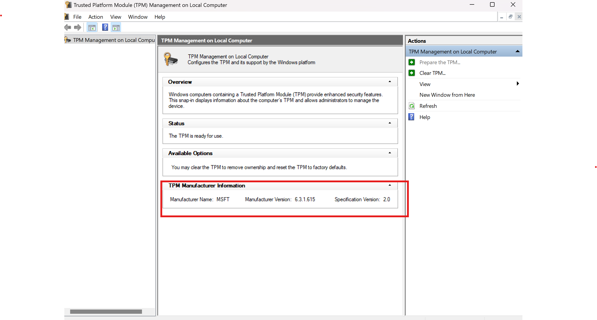

C'est vendredi soir, et vous venez de terminer votre journée de travail. Vous décidez de vous détendre avec un verre au bar d'en bas avant de rentrer chez vous. Tout se passe bien et vous détournez les yeux de votre ordinateur portable pour profiter de votre soirée, mais lorsque vous la regardez à nouveau, elle a disparu. Malheureusement, il contenait des données sensibles. Cependant, il y a encore de l'espoir, car vous avez chiffré votre disque dur avec [BitLocker](https://learn.microsoft.com/fr-fr/windows/security/operating-system-security/data-protection/bitlocker/) ! Mais [BitLocker](https://learn.microsoft.com/fr-fr/windows/security/operating-system-security/data-protection/bitlocker/) vous protège-t-il vraiment ? Regardons cela de plus près.

## Qu'est-ce que BitLocker ?
[BitLocker](https://learn.microsoft.com/fr-fr/windows/security/operating-system-security/data-protection/bitlocker/) est une fonctionnalité de Windows disponible depuis Windows Vista qui vous permet de chiffrer votre stockage disque pour éviter les risques de vol ou d'exposition des données en cas de perte ou de changement de périphérique.

Il est simple à configurer et transparent pour l'utilisateur s'il est configuré sans facteur d'authentification. Si vous ne savez pas s'il est activé ou non sur votre ordinateur, vous pouvez vérifier dans le panneau de configuration :\

## Comment fonctionne BitLocker ?
BitLocker chiffre et déchiffre le disque à l'aide d'une clé secrète appelée Volume Master Key (VMK). La question est : où stocker cette VMK pour qu'elle ne puisse pas être facilement récupérée ?\
Si elle est stockée sur le disque, il suffirait de brancher le disque sur un autre ordinateur et de récupérer la VMK pour déchiffrer l'intégralité du disque. Au lieu de cela, si vous en avez un (ce qui est le cas pour la plupart des ordinateurs actuels), la clé sera stockée dans un composant sécurisé appelé Trusted Platform Module (TPM).

## Qu'est-ce qu'un TPM ?
Le Trusted Platform Module (TPM) est un microcontrôleur conçu pour gérer les clés cryptographiques. Il a commencé à apparaître dans les ordinateurs vers 2005. En fait, il y avait besoin d'un composant dans les ordinateurs capable de garder des secrets et qui ne pouvait pas être corrompu, peu importe entre quelles mains il se trouvait.\
Les mêmes exigences s'appliquent aux cartes bancaires, où la banque veut s'assurer que les secrets à l'intérieur de la carte ne peuvent pas être extraits.\
Lorsqu'une clé est demandée au TPM, celui-ci vérifiera que vous êtes l'utilisateur légitime en utilisant différentes méthodes. Pour BitLocker, si le démarrage sécurisé est activé, il vérifiera que le firmware et le logiciel de l'ordinateur n'ont subi aucune modification malveillante.

## Protéger ou ne pas protéger ?
D'accord, après avoir dit tout cela, nous savons maintenant que la VMK est stockée en toute sécurité dans le TPM et ne peut être récupérée que par un BitLocker légitime. Que pourrait-il mal se passer ?\
En réalité, un acteur malveillant pourrait effectuer ce que l'on appelle le [TPM sniffing](https://blog.scrt.ch/2021/11/15/tpm-sniffing/), qui consiste à écouter les communications entre BitLocker et le TPM lorsque BitLocker veut déchiffrer le disque.

Mais vous devez savoir qu'il existe deux principaux types de TPM :
- __TPM firmware__ : Ce type de TPM fonctionne à l'intérieur du CPU.
- __TPM discret__ : Ce type de TPM est une puce sur la carte mère.

Comme vous l'avez peut-être déjà deviné, écouter un TPM firmware est une mission impossible, mais pour un TPM discret, quelques [tutoriels en ligne](https://post-cyberlabs.github.io/Offensive-security-publications/posts/2024_09_tpmandpin/#data-capture), de la motivation et des équipements coûtant environ 500 à 1500 $ peuvent faire des merveilles ! Il vous suffira d'identifier la puce TPM sur votre carte mère et de souder vos sondes sur les broches du TPM, et c'est parti !

Pour déterminer le type de TPM que vous avez, il n'y a pas de méthode directe. Vous pouvez essayer de l'identifier en utilisant `tpm.msc` sur Windows et rechercher un TPM correspondant au fabricant et à la version :\

Si cela ne fonctionne pas, vous devrez peut-être vérifier les spécifications de votre ordinateur portable.

Maintenant, même si vous avez un __TPM discret__, il y a encore de l'espoir. En effet, BitLocker vous permet d'ajouter un facteur d'authentification tel qu'un PIN ou une clé de démarrage. Dans ce cas, la VMK ne peut être demandée au TPM que si vous fournissez le facteur correct. Sans cela, le TPM ne vous donnera rien !\
Le brute-forcing du facteur n'est pas une option viable car cela nécessiterait d'envoyer des requêtes au TPM, ce qui nécessiterait de falsifier le firmware ou le logiciel. Comme je l'ai dit plus tôt, toute modification de ces composants empêchera le TPM de répondre.\
Ainsi, la seule façon serait de tromper l'utilisateur pour qu'il entre son PIN pendant que des sondes sont en place pour écouter, ce qui est très peu probable.\
Un excellent [article](https://blog.scrt.ch/2024/10/28/privilege-escalation-through-tpm-sniffing-when-bitlocker-pin-is-enabled/) de l'équipe offensive suisse d'Orange Cyberdefense l'explique très bien.

## Récapitulatif
Comme vous pouvez le voir, BitLocker n'est pas parfait mais fournit déjà une couche de sécurité supplémentaire contre le vol de données, en particulier si vous possédez un TPM firmware. En outre, un PIN ou une clé de démarrage peut être ajouté pour plus de robustesse.\
Ce diagramme de flux fournit un aperçu rapide de la sécurité de BitLocker :\

