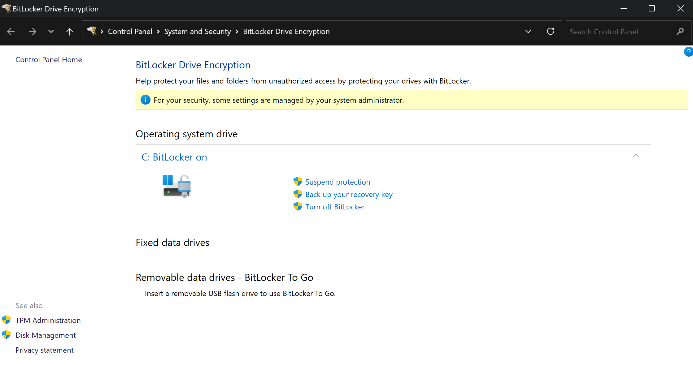

周五晚上，你刚刚结束了一天的工作。你决定在楼下的酒吧喝一杯放松一下，然后再回家。一切都很顺利，你放松地享受着夜晚，但当你再次看向公文包时，它已经不见了。不幸的是，它里面装有敏感数据。然而还有希望，因为你用 [BitLocker](https://learn.microsoft.com/zh-cn/windows/security/operating-system-security/data-protection/bitlocker/) 加密了硬盘！但 [BitLocker](https://learn.microsoft.com/zh-cn/windows/security/operating-system-security/data-protection/bitlocker/) 真能保护你吗？让我们仔细看看。

## 什么是 BitLocker？
[BitLocker](https://learn.microsoft.com/zh-cn/windows/security/operating-system-security/data-protection/bitlocker/) 是自 Windows Vista 起提供的一项 Windows 功能，它允许你加密磁盘存储，以避免数据被盗或暴露的风险。

如果没有配置身份验证因素，它的设置非常简单且对用户透明。如果你不确定电脑上是否启用了 BitLocker，可以在控制面板中检查：\

## BitLocker 如何工作？
BitLocker 使用一个称为卷主密钥 (VMK) 的密钥来加密和解密磁盘。问题是如何存储这个 VMK 以防止它被轻易获取？\
如果将其存储在磁盘上，我们只需将磁盘插入另一台电脑并检索 VMK 即可解密整个磁盘。相反，如果你的电脑配备了一个（如今大多数电脑都有），密钥将存储在一个称为可信平台模块 (TPM) 的安全组件中。

## 什么是 TPM？
可信平台模块 (TPM) 是一种专门设计用于管理加密密钥的微控制器。它大约在 2005 年开始出现在电脑中。实际上，电脑需要一个能够保守秘密且无法被破坏的组件，无论它落入谁的手中。\
类似的要求也适用于银行卡，银行希望确保卡内的秘密无法被提取。\
当向 TPM 请求密钥时，TPM 将通过不同的方法验证你是否是合法用户。对于 BitLocker，如果启用了安全启动，它将验证电脑的固件和软件是否未被恶意修改。

## 保护还是不保护？
好了，说了这么多，我们现在知道 VMK 安全地存储在 TPM 中，并且只能由合法的 BitLocker 检索。那么会出什么问题呢？\
实际上，攻击者可能会执行所谓的 [TPM 嗅探](https://blog.scrt.ch/2021/11/15/tpm-sniffing/)，即在 BitLocker 想要解密驱动器时窃听 BitLocker 和 TPM 之间的通信。

但你需要知道 TPM 有两种主要类型：
- __固件 TPM__：这种 TPM 运行在 CPU 内部。
- __离散 TPM__：这种 TPM 是主板上的一个芯片。

正如你可能已经猜到的，窃听固件 TPM 几乎是不可能的，但对于离散 TPM，一些 [网络教程](https://post-cyberlabs.github.io/Offensive-security-publications/posts/2024_09_tpmandpin/#data-capture)、动机和大约 500 至 1500 美元的设备就可以大显身手！你只需识别主板上的 TPM 芯片并将探针焊接到 TPM 的引脚上，就可以开始了！

要确定你拥有哪种类型的 TPM，没有直接的方法。你可以尝试使用 Windows 的 `tpm.msc` 工具并搜索与制造商和版本匹配的 TPM：\

如果这不起作用，你可能需要检查笔记本电脑的规格。

即使你有一个 __离散 TPM__，仍然有希望。实际上，BitLocker 允许你添加一个身份验证因素，例如 PIN 或启动密钥。在这种情况下，只有在提供正确的因素时，TPM 才会允许请求 VMK。否则，TPM 不会提供任何信息！\
暴力破解因素不是一个可行的选项，因为这需要向 TPM 发送请求，这将需要篡改固件或软件。如前所述，对这些组件的任何修改都会阻止 TPM 响应。\
因此，唯一的方法是诱骗用户在设置了监听探针的情况下输入其 PIN，但这种情况非常不可能。\
瑞士 Orange Cyberdefense 攻击团队的一篇 [精彩文章](https://blog.scrt.ch/2024/10/28/privilege-escalation-through-tpm-sniffing-when-bitlocker-pin-is-enabled/)对此进行了很好的解释。

## 总结
正如你所见，BitLocker 并非完美无缺，但它已经为防止数据被盗提供了额外的安全层，尤其是如果你拥有固件 TPM。此外，还可以添加 PIN 或启动密钥以增强安全性。\
此流程图简要概述了 BitLocker 的安全性：\

