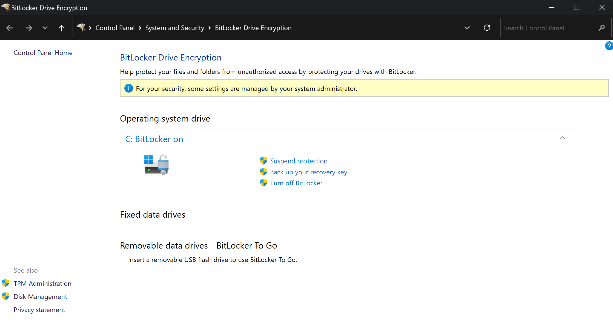
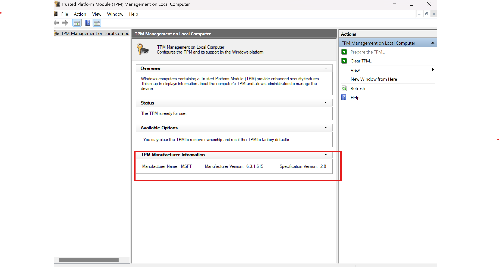

It's Friday evening, and you've just wrapped up work. You decide to unwind with a drink at the bar downstairs before heading home. Everything is going well and you take your eyes off your briefcase enjoying your evening, byt when you look at it again, it's gone. Unfortunately, it contained sensitive data. However there's still hope because you encrypted your hard drive with [BitLocker](https://learn.microsoft.com/en-us/windows/security/operating-system-security/data-protection/bitlocker/)! But is [BitLocker](https://learn.microsoft.com/en-us/windows/security/operating-system-security/data-protection/bitlocker/) truly protecting you? Let's take a closer look.

## What's BitLocker?
[BitLocker](https://learn.microsoft.com/en-us/windows/security/operating-system-security/data-protection/bitlocker/) is a Windows feature available since Windows Vista that allows you to encrypt your disk storage to avoid data theft or exposure risks when losing or changing device.

It's simple to set up and transparent for the user if configured without an authentification factor. If you're not sure wether it's enabled or not on your computer, you can verify in the control panel:\

## How's BitLocker working?
BitLocker encrypts and decrypts the disk using a secret key called the Volume Master Key (VMK). The question is where to store this VMK so it can't be easily retrieved?\
If stored on the disk, we would simply have to plug the disk on another computer and retrieve the VMK to decrypt the entire disk. Instead, if you have one (which is the case for most of computers nowadays), the key will be stored in a secured component called a Trusted Platform Module (TPM).

## What's a TPM?
The Trusted Platform Module (TPM) is a specialized microcontroller designed to manage cryptographic keys. It started appearing in computers around 2005. As a matter of fact, there was a need for a component in computers that could keep secrets and couldn't be corrupted, no matter whose hands it was in.
Same requirements applied for bank cards, where the bank wants to ensure that the secrets inside the card can't be extracted.\
When requesting a key to the TPM, the TPM will verify that you're the legitimate user using different methods. For BitLocker if the secure boot is enabled it will verify that the firmware and software of the computer didn't undergo any malicious modification.

## Protect or not protect?
Okay so after saying all that, we now know that the VMK is securely stored on the TPM and can only be retrieved by a legitimate BitLocker. What could go wrong?\
Actually a threat actor could perform what we call [TPM sniffing](https://blog.scrt.ch/2021/11/15/tpm-sniffing/) which involves eavesdropping on the communication between BitLocker and the TPM when BitLocker wants to decrypt the drive.

But you have to know that there are two main types of TPM:
- __TPM firmware__: This type of TPM runs inside the CPU.
- __discrete TPM__: This type of TPM is a chip on the motherboard.

As you may have already guessed eavesdropping on a TPM firmware is mission impossible but for a discrete TPM, some [internet tutorials](https://post-cyberlabs.github.io/Offensive-security-publications/posts/2024_09_tpmandpin/#data-capture), motivation and equipments costing around 500$ to 1500$ can make wonders! You'll just have to identify the TPM chip on your motherboard and solder your probes on the legs of the TPM and here we go!

To determine which type of TPM you have, there is no straight way. You can try to identify it using `tpm.msc` on Windows and search for a TPM matching the manufacturer and version:\

If this doesn't work, you may have to check your laptop's specifications.

Now, event if you have a __discrete TPM__, there is still hope. Indeed, BitLocker allows you to add an authentification factor such as a PIN or startup key. In this case, the VMK can only be requested to the TPM if you provide the correct factor. Without it, the TPM won't give you anything!\
Brute-forcing the factor is not a viable option because it would require sending requests to the TPM, which would necessitate to tamper the firmware or software. As I said earlier, any modification to these components will prevent the TPM from responding.\
Then, the only way would be to trick the user to enter their PIN while probes are set to listen which is very unlikely.\
A great [write up](https://blog.scrt.ch/2024/10/28/privilege-escalation-through-tpm-sniffing-when-bitlocker-pin-is-enabled/) of the Switzerland offensive team of Orange Cyberdefense explains it very well.

## Recap
As you can see, BitLocker isn't flawless but already provides an additional security layer against data theft especially if you possess a TPM firmware. On top of that, a PIN or startup key can be added for more robustness.\
This flowchart provides a brief overview of BitLocker security:\
